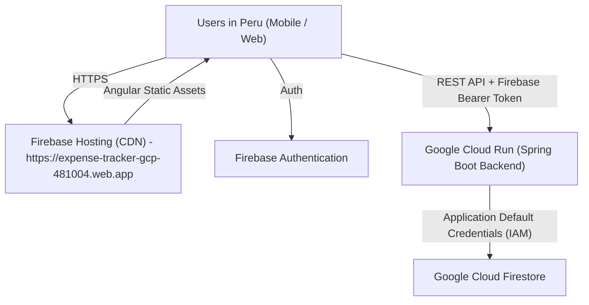

# Design Doc: Cloud Deployment & Public Access

## 1. Overview
The goal of this design is to make the **Expense Tracker** application securely accessible over the internet for testing and usage with friends in Lima, Peru, with zero infrastructure maintenance and 100% free-tier compatibility.

---

## 2. Architecture & Tech Stack

### Components:
1. **Frontend (Angular SPA)**:
   - Hosted on **Firebase Hosting** (`https://expense-tracker-gcp-481004.web.app` or custom domain).
   - Global CDN delivery with automatic SSL/TLS.
   - Production environment (`environment.prod.ts`) configured with production API URL.

2. **Backend (Spring Boot 4 / Java 21)**:
   - Containerized using an optimized multi-stage Docker image (Eclipse Temurin 21 JRE).
   - Deployed on **Google Cloud Run** in region `us-central1` or `southamerica-east1` (closest with lowest latency and full free-tier coverage).
   - Scales to 0 instances when idle to maintain $0 monthly cost.

3. **Authentication & Security**:
   - Cloud Run backend uses GCP IAM and Google Application Default Credentials (`GoogleCredentials.getApplicationDefault()`) to talk to Firestore without static JSON keys.
   - Spring Boot CORS configured to permit requests from the Firebase Hosting origin (`https://expense-tracker-gcp-481004.web.app` and `https://expense-tracker-gcp-481004.firebaseapp.com`).
   - Every API request validated via Firebase ID token (`FirebaseTokenFilter`).

---

## 3. API Contract & CORS

### Production Origins:
- `https://expense-tracker-gcp-481004.web.app`
- `https://expense-tracker-gcp-481004.firebaseapp.com`
- `http://localhost:4200` (for local development)

### Endpoints:
- All paths start with `/api/v1/*` as per [AGENTS.md](file:///Users/jampiermendoza/Projects/expensetracker-monorepo/AGENTS.md).
- Secured with `Authorization: Bearer <firebase_id_token>`.

---

## 4. Implementation Steps

1. **Backend Containerization**:
   - Add `backend/Dockerfile` using multi-stage build (`eclipse-temurin:21-jdk` $\rightarrow$ `eclipse-temurin:21-jre-alpine`).
   - Add `backend/.dockerignore`.
   - Update Spring Boot CORS configuration to allow production Firebase domains dynamically via environment/property configuration.

2. **Frontend Firebase Hosting Setup**:
   - Create `firebase.json` and `.firebaserc` configuring Angular build directory (`frontend/dist/angular-firebase/browser`).
   - Add `frontend/src/environments/environment.prod.ts` with Cloud Run backend API URL.
   - Configure `angular.json` file replacement for production build.

3. **Deployment Workflow**:
   - Provide a simple deployment script / command sequence using `gcloud` and `firebase-tools`.
   - Add GitHub Actions workflow for automated deployments on push to `main` (optional / dual workflow).

---

## 5. Verification Plan
1. Build and run backend container locally via Docker (optional test).
2. Deploy backend to Cloud Run and verify public HTTPS endpoint.
3. Build Angular frontend with production configuration and deploy to Firebase Hosting.
4. Verify user sign-in and transaction management from browser/mobile over the public internet.
