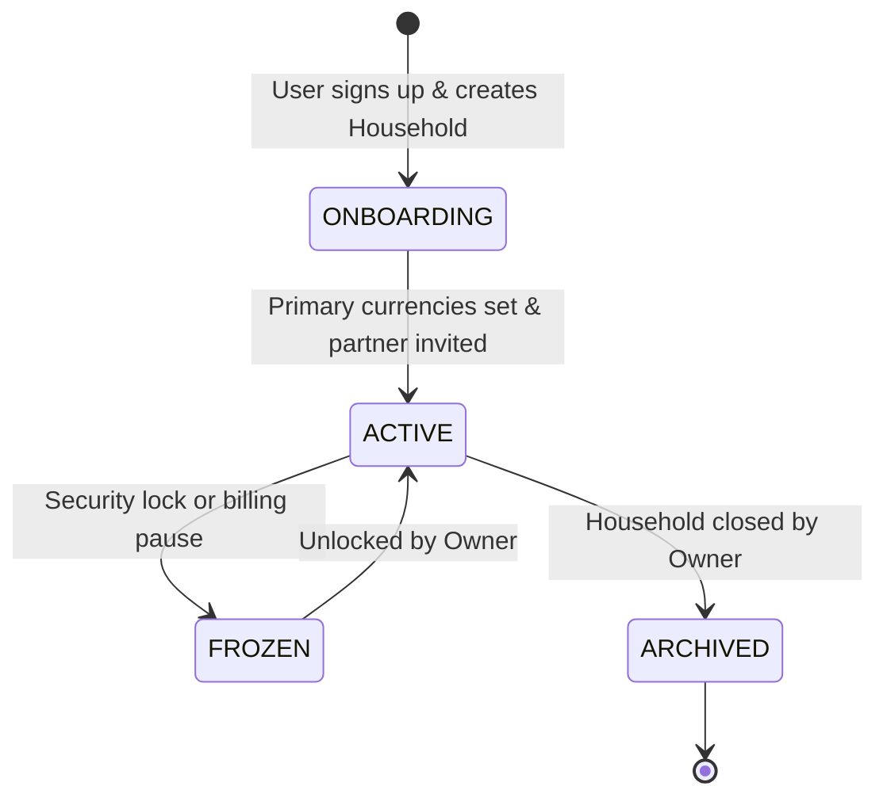
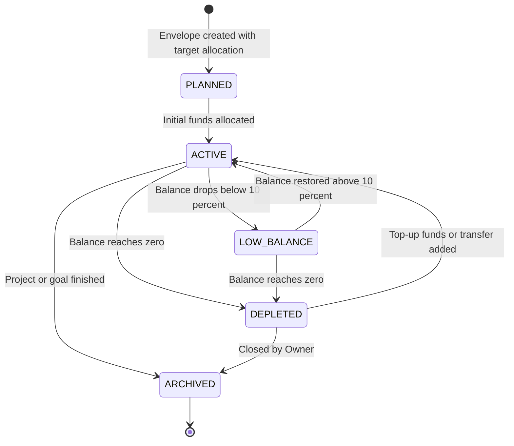
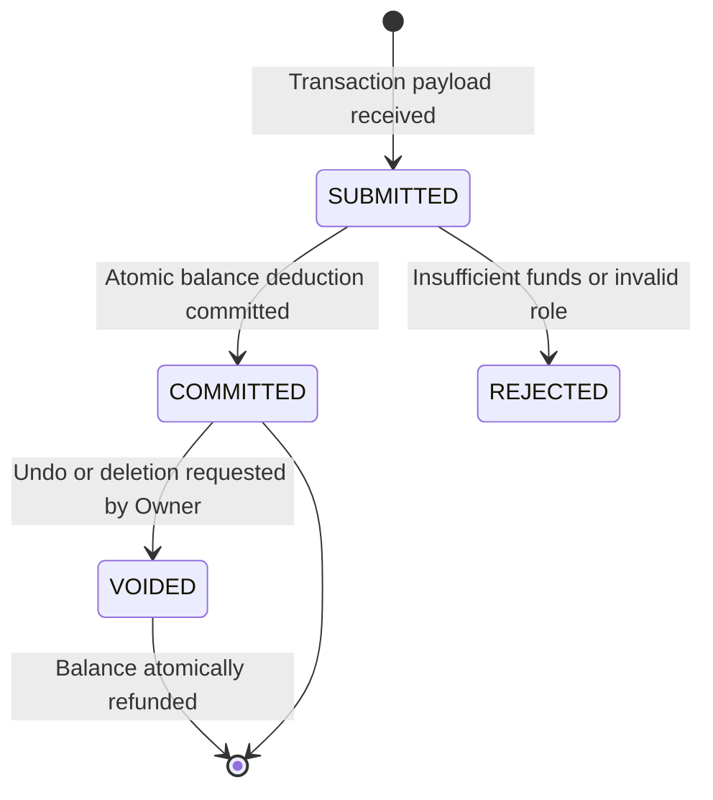
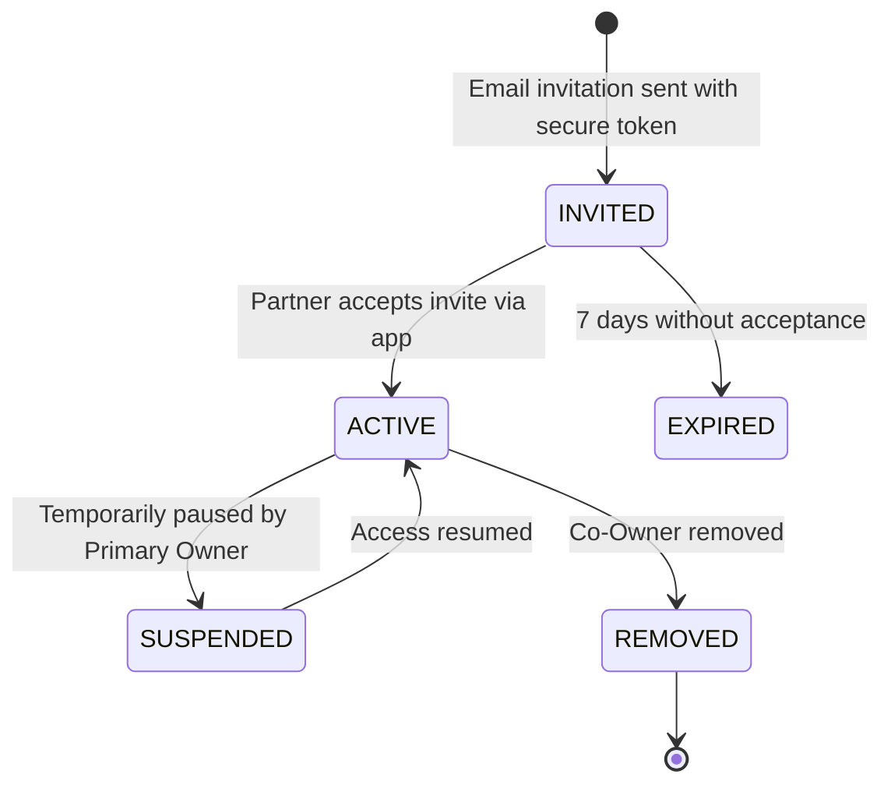
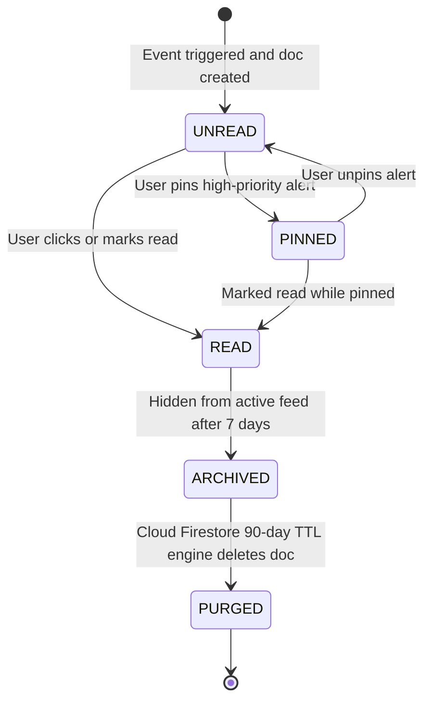

# Design Document: Household Multi-Budget Envelope Ledger & In-App Activity Center

## 1. Executive Summary & Problem Context
This design document formalizes the transformation of the Expense Tracker into a **Household-Centric Multi-Budget Envelope Ledger & In-App Activity Center**.

### Core Objectives:
1. **Household Shared Liquidity:** Provide joint visibility for partners/spouses into consolidated remaining liquidity across all shared budget envelopes.
2. **Sub-3-Tap Mobile Expense Entry:** Deliver a low-friction entry modal leveraging native mobile numeric keypads and smart defaults.
3. **Envelope Lifecycle & Rebalancing:** Support finite envelope balances (`PLANNED`, `ACTIVE`, `LOW_BALANCE`, `DEPLETED`, `ARCHIVED`) and 1-step inter-envelope fund transfers.
4. **Bounded In-App Activity Center:** Guarantee alert delivery via an in-app drawer backed by Cloud Firestore with automatic 90-day TTL document purging.
5. **Immutable Financial Ledger:** Use integer minor currency units (`cents`) and snapshot balances (`balanceAfterCents`) to ensure zero-drift audit trails.

---

## 2. Multi-Tier Entity Lifecycles

### 2.1 Household Lifecycle


### 2.2 Budget Envelope Lifecycle


### 2.3 Transaction Lifecycle


### 2.4 Co-Owner Invitation Lifecycle


### 2.5 Notification & Alert Lifecycle


---

## 3. RBAC Permission Matrix (Co-Ownership Model)

| Action / Privilege | **PRIMARY OWNER (Creator)** | **CO-OWNER (Partner)** |
| :--- | :---: | :---: |
| **View Household Consolidated Liquidity** | ✅ | ✅ |
| **Create / Edit / Archive Envelopes** | ✅ | ✅ |
| **Log Expenses & Income Top-Ups** | ✅ | ✅ |
| **Transfer Funds Between Envelopes** | ✅ | ✅ |
| **Invite & Manage Household Co-Owners** | ✅ | ✅ |
| **Delete / Close the Entire Household** | ✅ | ❌ |

---

## 4. Visual Wireframes Catalog

### 4.1 Household Creation Flow (`/households/new`)
```text
┌─────────────────────────────────────────────────────────┐
│  [Logo] ExpenseTracker                     [ Step 1/2 ] │
├─────────────────────────────────────────────────────────┤
│  CREATE YOUR HOUSEHOLD                                  │
│  Set up a shared space for joint budgeting and expenses.│
│                                                         │
│  Household Name:                                        │
│  ┌───────────────────────────────────────────────────┐  │
│  │ Mendoza Family                                    │  │
│  └───────────────────────────────────────────────────┘  │
│                                                         │
│  Base Currencies (Select all that apply):               │
│  [ ☑ PEN (Peruvian Sol) ]     [ ☑ USD (US Dollar) ]     │
│  [ ☐ EUR (Euro) ]             [ ☐ COP (Colombian Peso) ]│
│                                                         │
│  Invite Partner as Co-Owner (Optional):                 │
│  ┌───────────────────────────────────────────────────┐  │
│  │ maria@example.com (Partner will receive invite)   │  │
│  └───────────────────────────────────────────────────┘  │
│                                                         │
│  [ CANCEL ]                    [ CREATE HOUSEHOLD → ]   │
└─────────────────────────────────────────────────────────┘
```

### 4.2 Household Dashboard (`/dashboard`)
```text
┌─────────────────────────────────────────────────────────┐
│  [Logo] ExpenseTracker   [🏡 Mendoza Family ▾] [🔔 (3)]│
├─────────────────────────────────────────────────────────┤
│  HOUSEHOLD CONSOLIDATED LIQUIDITY                       │
│  ┌───────────────────────────────────────────────────┐  │
│  │  S/. 14,200.00 PEN                                │  │
│  │  $ 850.00 USD                                     │  │
│  │  [ 4 Active Envelopes ]   [ 1 Low Balance Alert ] │  │
│  │  Members: You (Owner), Maria (Co-Owner)           │  │
│  └───────────────────────────────────────────────────┘  │
│                                                         │
│  ACTIVE ENVELOPES                                       │
│                                                         │
│  ┌───────────────────────────────────────────────────┐  │
│  │ 🍳 Kitchen Renovation               [CO-OWNER][PEN]│  │
│  │ S/. 3,450.00 remaining of S/. 5,000.00            │  │
│  │ [████████████████████░░░░░░░░░░░░] 69% (Healthy)  │  │
│  │ Last: S/. 250.00 (Plumbing) • 2h ago              │  │
│  └───────────────────────────────────────────────────┘  │
│                                                         │
│  ┌───────────────────────────────────────────────────┐  │
│  │ 🛒 Groceries & Market               [CO-OWNER][PEN]│  │
│  │ S/. 180.00 remaining of S/. 2,000.00              │  │
│  │ [██░░░░░░░░░░░░░░░░░░░░░░░░░░░░░░] 9% (⚠️ Low)    │  │
│  │ Last: S/. 85.00 (Supermarket) • Yesterday         │  │
│  └───────────────────────────────────────────────────┘  │
│                                                         │
│  ┌───────────────────────────────────────────────────┐  │
│  │ 🌴 Vacation Trip 2026               [CO-OWNER][USD]│  │
│  │ $ 750.00 remaining of $ 1,000.00                  │  │
│  │ [████████████████████░░░░░░░░░░░░] 75% (Healthy)  │  │
│  │ Last: $ 50.00 (Booking) • 3d ago                  │  │
│  └───────────────────────────────────────────────────┘  │
│                                                         │
│                                       ┌──────────────┐  │
│                                       │   ( + ) FAB  │  │
│                                       └──────────────┘  │
└─────────────────────────────────────────────────────────┘
```

### 4.3 Budget Envelope Creation Flow (`/budgets/new` or Modal)
```text
┌─────────────────────────────────────────────────────────┐
│  ← Back to Envelopes              [ Create Envelope ]   │
├─────────────────────────────────────────────────────────┤
│  CREATE BUDGET ENVELOPE                                 │
│  Household: 🏡 Mendoza Family (Shared with Maria)       │
│                                                         │
│  Envelope Title:                                        │
│  ┌───────────────────────────────────────────────────┐  │
│  │ Kitchen Renovation                                │  │
│  └───────────────────────────────────────────────────┘  │
│                                                         │
│  Initial Capital Allocation:                            │
│  ┌─────────────────────────────────┬─────────────────┐  │
│  │ 5,000.00                        │ Currency: [PEN▾]│  │
│  └─────────────────────────────────┴─────────────────┘  │
│                                                         │
│  Icon & Classification:                                 │
│  [ 🍳 Home Repair ] [ 🛒 Food ] [ ✈️ Travel ] [ 🚗 Auto ]│
│                                                         │
│  [ CANCEL ]                    [ SAVE ENVELOPE ]        │
└─────────────────────────────────────────────────────────┘
```

### 4.4 Sub-3-Tap Mobile Expense Entry Modal (Bottom Sheet)
```text
┌─────────────────────────────────────────────────────────┐
│                   === Drag Handle ===                   │
│  LOG TRANSACTION                 [ Expense | + Top-up ] │
│                                                         │
│  Envelope:                                              │
│  [ Kitchen Renovation (S/. 3,450 remaining)         ▾ ] │
│                                                         │
│  Amount:                                                │
│  ┌───────────────────────────────────────────────────┐  │
│  │   S/. 250.00                                      │  │ (Triggers Native OS Keyboard)
│  └───────────────────────────────────────────────────┘  │
│                                                         │
│  Date:     [ Today, 25 Sep 2026                    📅 ] │
│  Category: [ Plumbing Materials                     ▾ ] │
│  Note:     [ PVC pipes and waterproof sealant         ] │
│                                                         │
│  [  CONFIRM & SAVE TRANSACTION (Tap 3)  ]               │
└─────────────────────────────────────────────────────────┘
```

### 4.5 Inter-Envelope Transfer & Split Modal (`MatDialog`)
```text
┌─────────────────────────────────────────────────────────┐
│  TRANSFER / SPLIT ENVELOPE FUNDS                        │
├─────────────────────────────────────────────────────────┤
│  Source Envelope:                                       │
│  <strong>General Savings ($750.00 available)</strong>   │
│                                                         │
│  Destination Type:                                      │
│  ( ) Transfer to Existing Envelope                      │
│  (•) Spawn New Envelope from this Amount                │
│                                                         │
│  New Envelope Name:                                     │
│  ┌───────────────────────────────────────────────────┐  │
│  │ Vacation Trip 2026                                │  │
│  └───────────────────────────────────────────────────┘  │
│                                                         │
│  Transfer Amount:                                       │
│  ┌───────────────────────────────────────────────────┐  │
│  │ $ 300.00                                          │  │
│  └───────────────────────────────────────────────────┘  │
│                                                         │
│  [ CANCEL ]                    [ CONFIRM TRANSFER ]     │
└─────────────────────────────────────────────────────────┘
```

### 4.6 In-App Activity & Notification Drawer
```text
┌─────────────────────────────────────────────────────────┐
│  Activity & Notifications              [Mark All Read]  │
├─────────────────────────────────────────────────────────┤
│  📌 PINNED ALERTS (Max 5)                               │
│  ┌───────────────────────────────────────────────────┐  │
│  │ ⚠️ Low Balance: "Groceries & Market"   [ 📌 Unpin ]│
│  │ Dropped to S/. 180.00 (9% remaining)   [ ✓ Read ] │  │
│  └───────────────────────────────────────────────────┘  │
│                                                         │
│  🔴 RECENT ACTIVITY (Last 7 Days)                       │
│  ┌───────────────────────────────────────────────────┐  │
│  │ 💸 Expense Logged                   • 10m ago     │  │
│  │ Maria logged S/. 250.00 on "Kitchen Renovation"   │  │
│  │ Balance: S/. 3,450.00                             │  │
│  │                                        [ 📌 Pin ] │  │
│  │                                        [ ✓ Read ] │  │
│  └───────────────────────────────────────────────────┘  │
│                                                         │
│  [ Load More Earlier Activity (Page 1 of 3) ▾ ]         │
│                                                         │
│  [ Close Activity Drawer ]                              │
└─────────────────────────────────────────────────────────┘
```

### 4.7 Envelope Details & Immutable Ledger History (`/budgets/:id`)
```text
┌─────────────────────────────────────────────────────────┐
│  ← Back to Envelopes                    [⚙️ Settings]   │
├─────────────────────────────────────────────────────────┤
│  Kitchen Renovation                      [Active]       │
│  Household: Mendoza Family • Co-Owner: Maria            │
│                                                         │
│  Remaining Balance: S/. 3,450.00                        │
│  Initial Budget:    S/. 5,000.00                        │
│  Total Spent:       S/. 1,550.00 (31%)                  │
│                                                         │
│  [ + Log Expense ]   [ 💰 + Add Funds ]   [ ⇄ Transfer ]│
│                                                         │
│  IMMUTABLE LEDGER HISTORY                               │
│  ┌────────────┬─────────────────────┬─────────┬──────┐  │
│  │ Date       │ Description         │ Amount  │ Bal. │  │
│  ├────────────┼─────────────────────┼─────────┼──────┤  │
│  │ 25/09 01:15│ PVC Pipes (Carlos)  │ -250.00 │ 3450 │  │
│  │ 24/09 18:30│ Cement Bags (Maria) │ -800.00 │ 3700 │  │
│  │ 23/09 09:00│ Tool Rental (Carlos)│ -500.00 │ 4500 │  │
│  │ 22/09 10:00│ Initial Allocation  │+5000.00 │ 5000 │  │
│  └────────────┴─────────────────────┴─────────┴──────┘  │
└─────────────────────────────────────────────────────────┘
```

---

## 5. Domain Entities & Storage Architecture

```yaml
Household (Collection: households/{householdId}):
  id: string
  name: string
  status: "ONBOARDING" | "ACTIVE" | "FROZEN" | "ARCHIVED"
  baseCurrencies: string[] # ["PEN", "USD"]
  ownerId: string # Primary Creator UID
  members:
    "usr_carlos_123": { role: "PRIMARY_OWNER", displayName: "Carlos", email: "carlos@example.com", status: "ACTIVE" }
    "usr_maria_456": { role: "CO_OWNER", displayName: "Maria", email: "maria@example.com", status: "ACTIVE" }
  memberIds: string[]
  createdAt: Instant
  updatedAt: Instant

Budget (Collection: budgets/{budgetId}):
  id: string
  householdId: string
  title: string
  initialAmountCents: long (e.g. 500000 for S/. 5,000.00)
  currentBalanceCents: long (e.g. 345000 for S/. 3,450.00)
  currency: string
  status: "PLANNED" | "ACTIVE" | "LOW_BALANCE" | "DEPLETED" | "ARCHIVED"
  ownerId: string
  createdAt: Instant
  updatedAt: Instant

Transaction (Collection: budgets/{budgetId}/transactions/{txId}):
  id: string
  householdId: string
  budgetId: string
  idempotencyKey: string
  type: "SPENDING" | "INCOME" | "ADJUSTMENT" | "TRANSFER_OUT" | "TRANSFER_IN"
  amountCents: long
  balanceAfterCents: long
  category: string
  note: string (nullable)
  linkedBudgetId: string (nullable)
  transferGroupId: string (nullable)
  transactionDate: Instant
  createdBy: string
  createdByName: string
  createdAt: Instant

Notification (Collection: notifications/{notificationId}):
  id: string
  householdId: string
  recipientId: string
  actorId: string
  budgetId: string
  budgetTitle: string
  type: "BUDGET_CREATED" | "BUDGET_DEPLETED" | "LOW_BALANCE_WARNING" | "EXPENSE_LOGGED" | "FUNDS_ADDED"
  title: string
  message: string
  isRead: boolean
  isPinned: boolean
  expiresAt: Instant (now + 90 days TTL)
  createdAt: Instant
```

---

## 6. REST API Contracts (`/api/v1/...`)

| Method | Path | Description | Request Body | Response Body |
| :--- | :--- | :--- | :--- | :--- |
| `POST` | `/api/v1/households` | Create Household | `{ name: string, baseCurrencies: string[], partnerEmail?: string }` | `201 Created` $\to$ `HouseholdDto` |
| `GET` | `/api/v1/households/current` | Get Active Household | *None* | `200 OK` $\to$ `HouseholdDto` |
| `POST` | `/api/v1/budgets` | Create Budget Envelope | `{ householdId: string, title: string, initialAmountCents: long, currency: string }` | `201 Created` $\to$ `BudgetDto` |
| `GET` | `/api/v1/budgets` | List Envelopes | *Query:* `?householdId=...&status=ACTIVE` | `200 OK` $\to$ `{ items: BudgetDto[], nextCursor: string }` |
| `GET` | `/api/v1/budgets/summary` | Consolidated Liquidity | *Query:* `?householdId=...` | `200 OK` $\to$ `{ balancesByCurrency: { [curr]: long }, activeCount: int }` |
| `POST` | `/api/v1/budgets/{id}/transactions` | Log Expense / Top-Up | `{ type: "SPENDING"\|"INCOME", amountCents: long, category: string, note?: string, transactionDate: string }` | `201 Created` $\to$ `TransactionDto` |
| `POST` | `/api/v1/budgets/transfers` | 1-Step Atomic Transfer | `{ sourceBudgetId: string, targetBudgetId: string, amountCents: long, note?: string }` | `200 OK` $\to$ `TransferResultDto` |
| `DELETE`| `/api/v1/budgets/{id}/transactions/{txId}` | Void / Refund Transaction | *None* | `200 OK` $\to$ `BudgetSummaryDto` |
| `GET` | `/api/v1/notifications` | Paginated Activity Feed | *Query:* `?limit=20&cursor=...` | `200 OK` $\to$ `{ items: NotificationDto[], nextCursor: string }` |
| `PATCH`| `/api/v1/notifications/{id}/read` | Mark Alert Read | *None* | `200 OK` $\to$ `{ id: string, isRead: true }` |
| `PATCH`| `/api/v1/notifications/{id}/pin` | Toggle Pin State | `{ isPinned: boolean }` | `200 OK` $\to$ `NotificationDto` |
| `POST` | `/api/v1/notifications/mark-all-read` | Mark All Read | *None* | `200 OK` $\to$ `{ updatedCount: int }` |

---

## 7. Verification Protocol

### Backend (`/backend`)
```bash
cd backend && ./gradlew test
```

### Frontend (`/frontend`)
```bash
cd frontend && npm test -- --watch=false --browsers=ChromeHeadless
```
