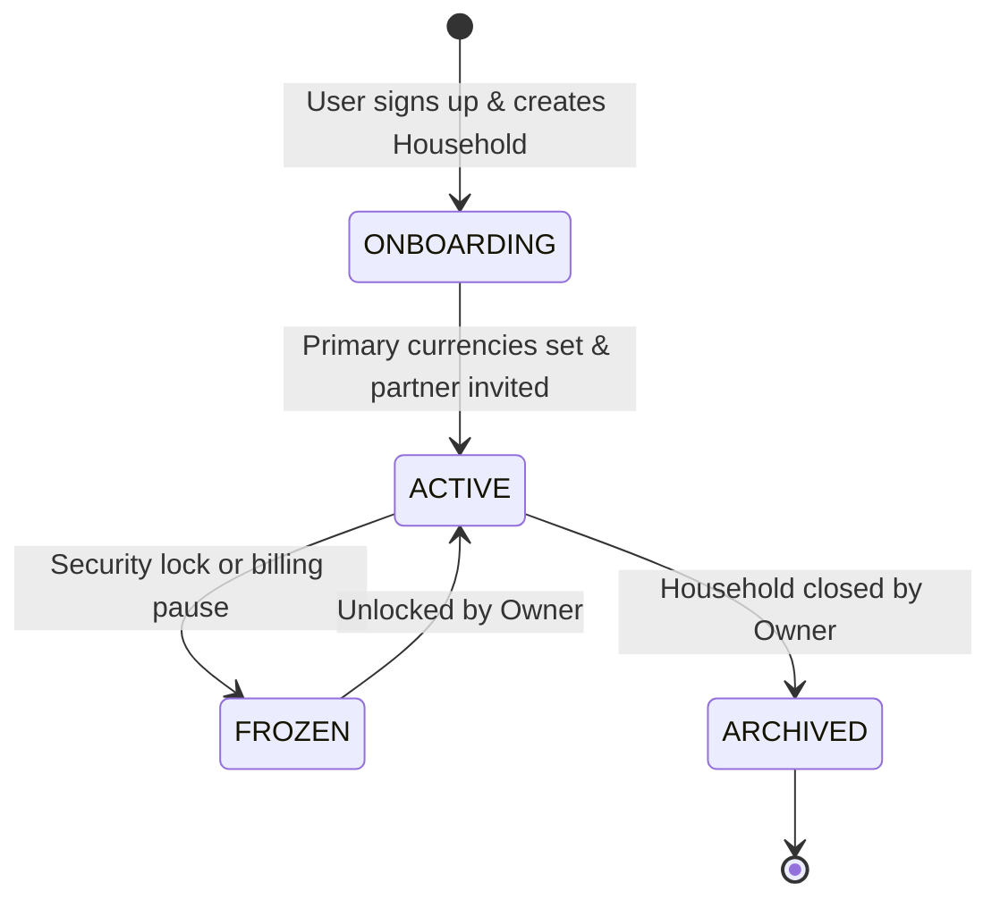
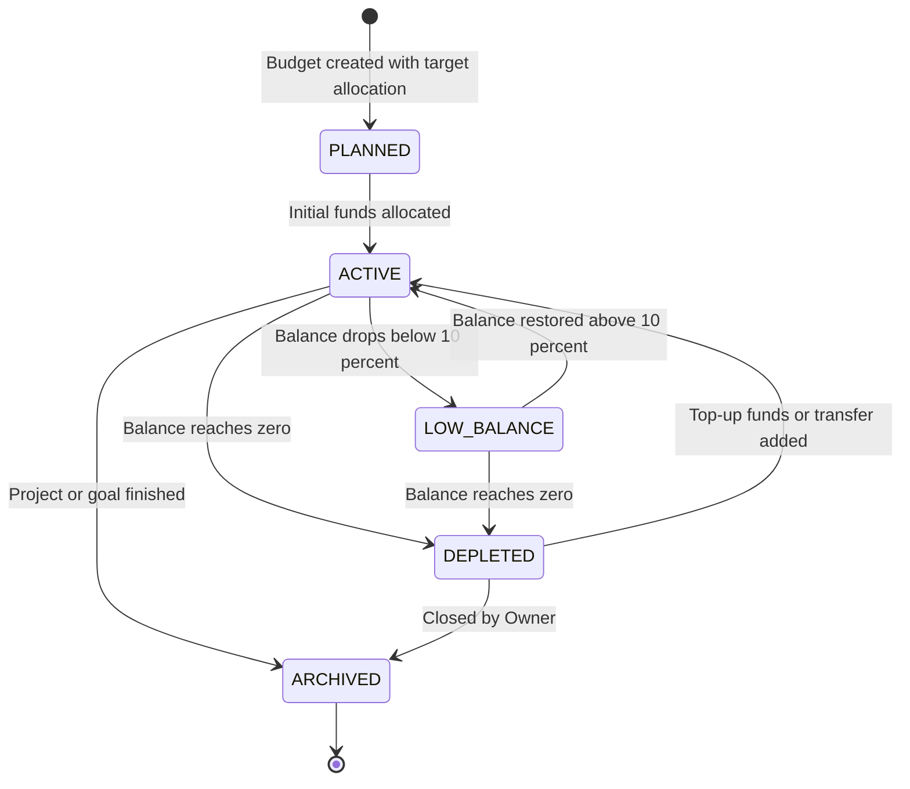
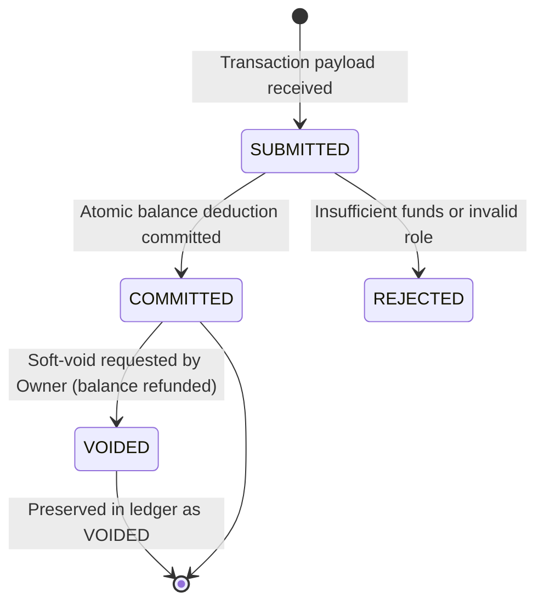
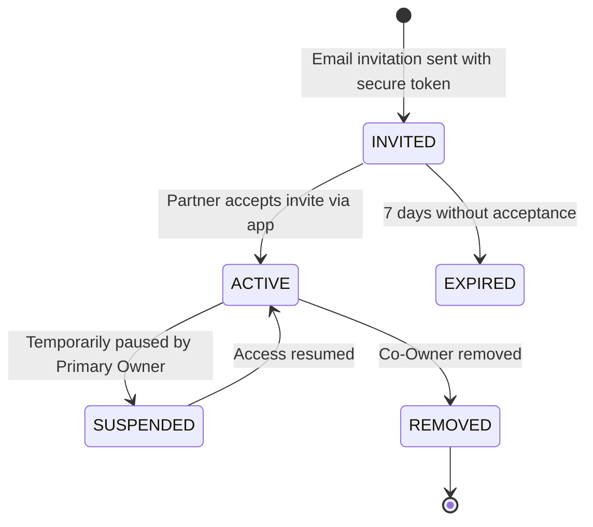
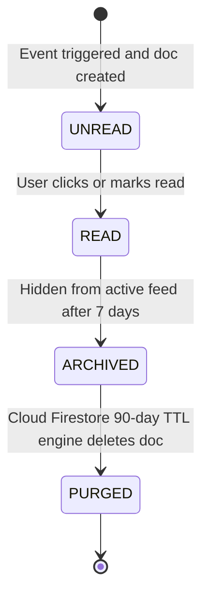
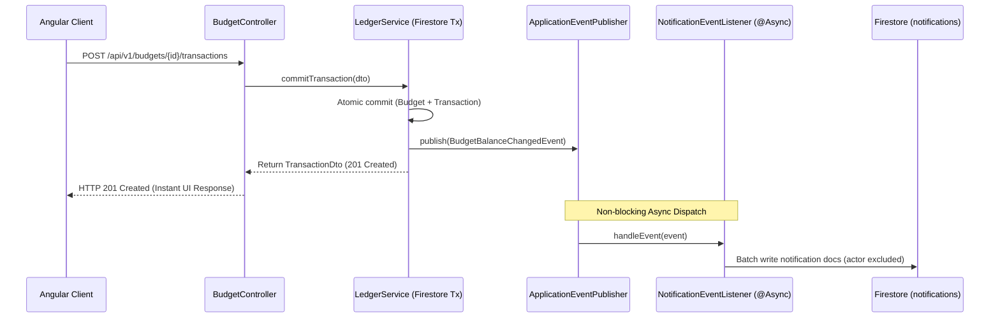

# Design Document: Household Multi-Budget Ledger & In-App Activity Center

## 1. Executive Summary & Problem Context
This design document formalizes the transformation of the Expense Tracker into a **Household-Centric Multi-Budget Ledger & In-App Activity Center**.

### Core Objectives:
1. **Household Shared Liquidity:** Provide joint visibility for partners/spouses into consolidated remaining liquidity across all shared budgets with cached snapshots.
2. **Sub-3-Tap Mobile Expense Entry:** Deliver a low-friction entry modal leveraging native mobile numeric keypads and smart defaults.
3. **Budget Lifecycle & Rebalancing:** Support finite budget balances (`PLANNED`, `ACTIVE`, `LOW_BALANCE`, `DEPLETED`, `ARCHIVED`) and 1-step inter-budget fund transfers with manual FX support.
4. **Bounded In-App Activity Center:** Guarantee non-blocking alert delivery decoupled via Spring Application Events and backed by Cloud Firestore 90-day TTL.
5. **Immutable Financial Ledger:** Use integer minor currency units (`cents`), hybrid metadata edits, soft-voiding, and snapshot balances (`balanceAfterCents`) to ensure zero-drift audit trails.

---

## 2. Multi-Tier Entity Lifecycles

### 2.1 Household Lifecycle
A **Household** is the primary multi-tenant container representing a shared financial space (e.g., *"Mendoza Family"*).



### 2.2 Budget Lifecycle
A **Budget** is a dedicated virtual container of capital within the household.



### 2.3 Transaction Lifecycle
Transactions are immutable financial events forming the append-only ledger.



### 2.4 Co-Owner Invitation Lifecycle



### 2.5 Notification & Alert Lifecycle



---

## 3. Core Architectural Decisions (Red Flag Resolutions)

### 3.1 Ledger Auditing & Mutation Strategy (Hybrid Model)
* **Non-Financial Edits (`PATCH /transactions/{id}`):** Changes to `note`, `category`, and `receiptUrl` update the document in place without altering balances.
* **Financial / Amount Corrections (`POST /transactions/{id}/void` & Re-issue):**
  * To preserve mathematical ledger integrity, modifying amounts marks the original record as `status = VOIDED`, atomically refunds the amount to `budget.currentBalanceCents`, and appends a new corrected transaction with a fresh snapshot balance (`balanceAfterCents`).

### 3.2 Cross-Currency Transfers with Manual Exchange Rates
* Inter-budget transfers between different currencies are supported via an explicit `exchangeRate: double` parameter.
* **Calculation:** `targetAmountCents = Math.round(sourceAmountCents * exchangeRate)`.
* Both sides of the transfer record the applied `exchangeRate` in their metadata.

### 3.3 Concurrency & Contention Policy
* Uses Google Cloud Firestore's built-in **optimistic locking and automatic exponential retry** mechanism in `Firestore.runTransaction()`.
* Fully supports simultaneous entries for household scale (<10 concurrent users).
* *Technical Debt Note:* Sharded distributed counters are documented for future architecture if transaction frequency ever exceeds 1 write/second per budget.

### 3.4 Data Archival & Soft-Deletion Standard
* **Zero-Transaction Budgets:** Can be hard-deleted.
* **Active Budgets with History:** Set to `status: "ARCHIVED"` (hidden from entry pickers, preserved in reports).
* **Transactions:** Set to `status: "VOIDED"` (amount refunded, retained in ledger for auditability).

### 3.5 Event-Driven Decoupled Notifications (Zero Transaction Contention)
To ensure core monetary transactions remain lightning-fast (<100ms) and never fail due to auxiliary notification fan-out, we decouple notification generation using Spring `ApplicationEventPublisher`:



### 3.6 Pre-Calculated Household Liquidity Snapshot
* The `Household` entity maintains `balancesByCurrency: Map<String, Long>` directly on its document.
* When any budget balance changes inside an atomic transaction, the parent household's currency balance map is updated in the same atomic commit.
* **Benefit:** `GET /api/v1/budgets/summary` reads exactly **1 document** instead of querying all $N$ budgets, reducing Firestore read costs by up to $90\%$.

---

## 4. RBAC Permission Matrix (Co-Ownership Model)

| Action / Privilege | **PRIMARY OWNER (Creator)** | **CO-OWNER (Partner)** |
| :--- | :---: | :---: |
| **View Household Consolidated Liquidity** | ✅ | ✅ |
| **Create / Edit / Archive Budgets** | ✅ | ✅ |
| **Log Expenses & Income Top-Ups** | ✅ | ✅ |
| **Edit Metadata / Void Own Transactions** | ✅ | ✅ |
| **Transfer Funds Between Budgets (with FX)**| ✅ | ✅ |
| **Invite & Manage Household Co-Owners** | ✅ | ✅ |
| **Delete / Close the Entire Household** | ✅ | ❌ |

---

## 5. Visual Wireframes & UI Routing Catalog

### Frontend Navigation Architecture

> [!NOTE]
> The wireframes below are framework-agnostic. In the Angular frontend layer, they are implemented using standard **Angular Material 3** components (`@angular/material`).

| Modality | UI Pattern | Route / Trigger | Angular Material 3 Component | Purpose |
| :--- | :--- | :--- | :--- | :--- |
| **Dedicated Route** | Full Page | `/dashboard` | `DashboardComponent` (`MatCard`, `MatProgressBar`) | Main Household overview & active budgets |
| **Dedicated Route** | Full Page | `/households/new` | `HouseholdCreateComponent` (`MatFormField`, `MatInput`) | Onboarding & initial setup |
| **Dedicated Route** | Full Page | `/settings/household` | `HouseholdSettingsComponent` (`MatList`, `MatButton`) | Co-owner management, currencies & danger zone |
| **Dedicated Route** | Full Page | `/budgets/new` | `BudgetCreateComponent` (`MatSelect`, `MatInput`) | Full budget creation form |
| **Dedicated Route** | Full Page | `/budgets/:id` | `BudgetDetailComponent` (`MatTable`, `MatChips`) | Ledger history & transaction table |
| **Dedicated Route** | Full Page | `/budgets/:id/settings` | `BudgetSettingsComponent` (`MatButton`, `MatDialog`) | Budget target adjustment, status & danger zone |
| **Contextual Overlay**| Slide-Up Sheet | *Triggered via FAB `+`* | `MatBottomSheet` | Fast sub-3-tap mobile expense logging |
| **Contextual Overlay**| Slide-Up Sheet | *Triggered via ledger row*| `MatBottomSheet` | Transaction details, note editing & soft-void |
| **Contextual Overlay**| Modal Dialog | *Triggered via Transfer* | `MatDialog` | Inter-budget fund transfers with live FX |
| **Contextual Overlay**| Side Drawer | *Triggered via Bell Icon* | `MatSidenav` | Bounded activity & notification drawer |

---

### 5.1 Household Creation Flow (`/households/new`)
```text
┌─────────────────────────────────────────────────────────┐
│  [Logo] ExpenseTracker                     [ Step 1/2 ] │
├─────────────────────────────────────────────────────────┤
│  CREATE YOUR HOUSEHOLD                                  │
│  Set up a shared space for joint budgeting and expenses.│
│                                                         │
│  Household Name:                                        │
│  ┌───────────────────────────────────────────────────┐  │
│  │ Mendoza Family                                    │  │
│  └───────────────────────────────────────────────────┘  │
│                                                         │
│  Base Currencies (Select all that apply):               │
│  [ ☑ PEN (Peruvian Sol) ]     [ ☑ USD (US Dollar) ]     │
│  [ ☐ EUR (Euro) ]             [ ☐ COP (Colombian Peso) ]│
│                                                         │
│  Invite Partner as Co-Owner (Optional):                 │
│  ┌───────────────────────────────────────────────────┐  │
│  │ maria@example.com (Partner will receive invite)   │  │
│  └───────────────────────────────────────────────────┘  │
│                                                         │
│  [ CANCEL ]                    [ CREATE HOUSEHOLD → ]   │
└─────────────────────────────────────────────────────────┘
```

---

### 5.2 Household Settings & Edit Page (`/settings/household`)
```text
┌─────────────────────────────────────────────────────────┐
│  ← Back to Dashboard             [ Household Settings ] │
├─────────────────────────────────────────────────────────┤
│  EDIT HOUSEHOLD DETAILS                                 │
│                                                         │
│  Household Name:                                        │
│  ┌───────────────────────────────────────────────────┐  │
│  │ Mendoza Family                                    │  │
│  └───────────────────────────────────────────────────┘  │
│                                                         │
│  Base Currencies:                                       │
│  [ ☑ PEN (Peruvian Sol) ]     [ ☑ USD (US Dollar) ]     │
│  [ ☐ EUR (Euro) ]             [ ☐ COP (Colombian Peso) ]│
│                                                         │
│  Household Co-Owners:                                   │
│  ┌───────────────────────────────────────────────────┐  │
│  │ 👤 Carlos (You)                 [ Primary Owner ] │  │
│  │ 👤 Maria (maria@example.com)    [ Co-Owner ] [✕]  │  │
│  │ [ + Invite Another Co-Owner ]                     │  │
│  └───────────────────────────────────────────────────┘  │
│                                                         │
│  Danger Zone:                                           │
│  [ Archive Household ]         [ Delete Household ]     │
│                                                         │
│  [ CANCEL ]                    [ SAVE CHANGES ]         │
└─────────────────────────────────────────────────────────┘
```

---

### 5.3 Household Dashboard (`/dashboard`)
```text
┌─────────────────────────────────────────────────────────┐
│  [Logo] ExpenseTracker   [🏡 Mendoza Family ▾] [🔔 (3)]│
├─────────────────────────────────────────────────────────┤
│  HOUSEHOLD CONSOLIDATED LIQUIDITY                       │
│  ┌───────────────────────────────────────────────────┐  │
│  │  S/. 14,200.00 PEN                                │  │
│  │  $ 850.00 USD                                     │  │
│  │  [ 4 Active Budgets ]   [ 1 Low Balance Alert ]   │  │
│  │  Members: You (Owner), Maria (Co-Owner)           │  │
│  └───────────────────────────────────────────────────┘  │
│                                                         │
│  ACTIVE BUDGETS                                         │
│                                                         │
│  ┌───────────────────────────────────────────────────┐  │
│  │ 🍳 Kitchen Renovation               [CO-OWNER][PEN]│  │
│  │ S/. 3,450.00 remaining of S/. 5,000.00            │  │
│  │ [████████████████████░░░░░░░░░░░░] 69% (Healthy)  │  │
│  │ Last: S/. 250.00 (Plumbing) • 2h ago              │  │
│  └───────────────────────────────────────────────────┘  │
│                                                         │
│  ┌───────────────────────────────────────────────────┐  │
│  │ 🛒 Groceries & Market               [CO-OWNER][PEN]│  │
│  │ S/. 180.00 remaining of S/. 2,000.00              │  │
│  │ [██░░░░░░░░░░░░░░░░░░░░░░░░░░░░░░] 9% (⚠️ Low)    │  │
│  │ Last: S/. 85.00 (Supermarket) • Yesterday         │  │
│  └───────────────────────────────────────────────────┘  │
│                                                         │
│  ┌───────────────────────────────────────────────────┐  │
│  │ 🌴 Vacation Trip 2026               [CO-OWNER][USD]│  │
│  │ $ 750.00 remaining of $ 1,000.00                  │  │
│  │ [████████████████████░░░░░░░░░░░░] 75% (Healthy)  │  │
│  │ Last: $ 50.00 (Booking) • 3d ago                  │  │
│  └───────────────────────────────────────────────────┘  │
│                                                         │
│                                       ┌──────────────┐  │
│                                       │   ( + ) FAB  │  │
│                                       └──────────────┘  │
└─────────────────────────────────────────────────────────┘
```

---

### 5.4 Create Budget Page (`/budgets/new`)
```text
┌─────────────────────────────────────────────────────────┐
│  ← Back to Dashboard              [ Create Budget ]     │
├─────────────────────────────────────────────────────────┤
│  CREATE BUDGET                                          │
│  Household: 🏡 Mendoza Family (Shared with Maria)       │
│                                                         │
│  Budget Title:                                          │
│  ┌───────────────────────────────────────────────────┐  │
│  │ Kitchen Renovation                                │  │
│  └───────────────────────────────────────────────────┘  │
│                                                         │
│  Initial Capital Allocation:                            │
│  ┌─────────────────────────────────┬─────────────────┐  │
│  │ 5,000.00                        │ Currency: [PEN▾]│  │
│  └─────────────────────────────────┴─────────────────┘  │
│                                                         │
│  Icon & Classification:                                 │
│  [ 🍳 Home Repair ] [ 🛒 Food ] [ ✈️ Travel ] [ 🚗 Auto ]│
│                                                         │
│  [ CANCEL ]                    [ SAVE BUDGET ]          │
└─────────────────────────────────────────────────────────┘
```

---

### 5.5 Budget Settings & Edit Page (`/budgets/:id/settings`)
```text
┌─────────────────────────────────────────────────────────┐
│  ← Back to Budget Details              [ Edit Budget ]  │
├─────────────────────────────────────────────────────────┤
│  EDIT BUDGET SETTINGS                                   │
│                                                         │
│  Budget Title:                                          │
│  ┌───────────────────────────────────────────────────┐  │
│  │ Kitchen Renovation & Appliances                   │  │
│  └───────────────────────────────────────────────────┘  │
│                                                         │
│  Adjust Total Capital Allocation:                       │
│  ┌─────────────────────────────────┬─────────────────┐  │
│  │ 6,000.00                        │ Currency: [PEN] │  │
│  └─────────────────────────────────┴─────────────────┘  │
│  <small>Current Remaining Balance: S/. 3,450.00</small> │
│                                                         │
│  Icon & Classification:                                 │
│  [ 🍳 Home Repair (Selected) ] [ 🛒 Food ] [ ✈️ Travel ]│
│                                                         │
│  Lifecycle Status:                                      │
│  Status: [ ACTIVE ▾ ] (Options: ACTIVE, ARCHIVED)       │
│                                                         │
│  Danger Zone:                                           │
│  [ 🗑️ Archive Budget & Hide from Active View ]         │
│                                                         │
│  [ CANCEL ]                    [ SAVE CHANGES ]         │
└─────────────────────────────────────────────────────────┘
```

---

### 5.6 Sub-3-Tap Mobile Expense Entry Modal (Bottom Sheet)
```text
┌─────────────────────────────────────────────────────────┐
│                   === Drag Handle ===                   │
│  LOG TRANSACTION                 [ Expense | + Top-up ] │
│                                                         │
│  Budget:                                                │
│  [ Kitchen Renovation (S/. 3,450 remaining)         ▾ ] │
│                                                         │
│  Amount:                                                │
│  ┌───────────────────────────────────────────────────┐  │
│  │   S/. 250.00                                      │  │ (Triggers Native OS Keyboard)
│  └───────────────────────────────────────────────────┘  │
│                                                         │
│  Date:     [ Today, 25 Sep 2026                    📅 ] │
│  Category: [ Plumbing Materials                     ▾ ] │
│  Note:     [ PVC pipes and waterproof sealant         ] │
│                                                         │
│  [  CONFIRM & SAVE TRANSACTION (Tap 3)  ]               │
└─────────────────────────────────────────────────────────┘
```

---

### 5.7 Transaction Edit / Delete Modal (Slide-Up Sheet)
```text
┌─────────────────────────────────────────────────────────┐
│                   === Drag Handle ===                   │
│  EDIT TRANSACTION                                       │
│  Budget: Kitchen Renovation                             │
│                                                         │
│  Amount:                                                │
│  ┌───────────────────────────────────────────────────┐  │
│  │ S/. 250.00                                        │  │ (Directly editable)
│  └───────────────────────────────────────────────────┘  │
│                                                         │
│  Date:     [ 25 Sep 2026                           📅 ] │
│  Category: [ Plumbing Materials                     ▾ ] │
│  Note:     [ PVC pipes and waterproof sealant         ] │
│                                                         │
│  [ 🗑️ Delete Transaction ]                              │
│                                                         │
│  [ CANCEL ]                    [ SAVE CHANGES ]         │
└─────────────────────────────────────────────────────────┘
```

---

### 5.8 Inter-Budget Transfer & Split Modal with FX
```text
┌─────────────────────────────────────────────────────────┐
│  TRANSFER / SPLIT BUDGET FUNDS                          │
├─────────────────────────────────────────────────────────┤
│  Source Budget:                                         │
│  General Savings ($750.00 USD available)                │
│                                                         │
│  Destination Budget:                                    │
│  [ Groceries & Market (PEN)                         ▾ ] │
│                                                         │
│  Transfer Amount:                                       │
│  ┌───────────────────────────────────────────────────┐  │
│  │ $ 100.00 USD                                      │  │
│  └───────────────────────────────────────────────────┘  │
│                                                         │
│  Exchange Rate (USD → PEN):                             │
│  ┌─────────────────────────────────┬─────────────────┐  │
│  │ 1 USD = [ 3.75 ] PEN            │ S/. 375.00 PEN  │  │
│  └─────────────────────────────────┴─────────────────┘  │
│                                                         │
│  Note (Optional):                                       │
│  ┌───────────────────────────────────────────────────┐  │
│  │ Converted USD savings for weekly groceries        │  │
│  └───────────────────────────────────────────────────┘  │
│                                                         │
│  [ CANCEL ]                    [ CONFIRM TRANSFER ]     │
└─────────────────────────────────────────────────────────┘
```

---

### 5.9 In-App Activity & Notification Drawer
```text
┌─────────────────────────────────────────────────────────┐
│  Activity & Notifications              [Mark All Read]  │
├─────────────────────────────────────────────────────────┤
│  🔴 RECENT ACTIVITY (Last 7 Days)                       │
│  ┌───────────────────────────────────────────────────┐  │
│  │ 💸 Expense Logged                   • 10m ago     │  │
│  │ Maria logged S/. 250.00 on "Kitchen Renovation"   │  │
│  │ Balance: S/. 3,450.00                             │  │
│  │                                                   │  │
│  │ [ ↗ View Budget (/budgets/bdg_123) ]   [ ✓ Read ] │  │
│  └───────────────────────────────────────────────────┘  │
│                                                         │
│  ┌───────────────────────────────────────────────────┐  │
│  │ ⚠️ Low Balance Alert                • 2h ago      │  │
│  │ "Groceries & Market" dropped below 10%            │  │
│  │ Balance: S/. 180.00 (9% remaining)                │  │
│  │                                                   │  │
│  │ [ ↗ View Budget (/budgets/bdg_456) ]   [ ✓ Read ] │  │
│  └───────────────────────────────────────────────────┘  │
│                                                         │
│  [ Load More Earlier Activity (Page 1 of 3) ▾ ]         │
│                                                         │
│  [ Close Activity Drawer ]                              │
└─────────────────────────────────────────────────────────┘
```

---

### 5.10 Budget Details & Immutable Ledger History (`/budgets/:id`)
```text
┌─────────────────────────────────────────────────────────┐
│  ← Back to Budgets                      [⚙️ Settings]   │
├─────────────────────────────────────────────────────────┤
│  Kitchen Renovation                      [Active]       │
│  Household: Mendoza Family • Co-Owner: Maria            │
│                                                         │
│  Remaining Balance: S/. 3,450.00                        │
│  Initial Budget:    S/. 5,000.00                        │
│  Total Spent:       S/. 1,550.00 (31%)                  │
│                                                         │
│  [ + Log Expense ]   [ 💰 + Add Funds ]   [ ⇄ Transfer ]│
│                                                         │
│  IMMUTABLE LEDGER HISTORY                               │
│  ┌────────────┬─────────────────────┬─────────┬──────┐  │
│  │ Date       │ Description         │ Amount  │ Bal. │  │
│  ├────────────┼─────────────────────┼─────────┼──────┤  │
│  │ 25/09 01:15│ PVC Pipes (Carlos)  │ -250.00 │ 3450 │  │
│  │ 24/09 18:30│ Cement Bags (Maria) │ -800.00 │ 3700 │  │
│  │ 23/09 09:00│ Tool Rental (Carlos)│ -500.00 │ 4500 │  │
│  │ 22/09 10:00│ Initial Allocation  │+5000.00 │ 5000 │  │
│  └────────────┴─────────────────────┴─────────┴──────┘  │
└─────────────────────────────────────────────────────────┘
```

---

## 6. Domain Entities & Storage Architecture

```yaml
Household (Collection: households/{householdId}):
  id: string
  name: string
  status: "ONBOARDING" | "ACTIVE" | "FROZEN" | "ARCHIVED"
  baseCurrencies: string[] # ["PEN", "USD"]
  balancesByCurrency: Map<string, long> # Pre-calculated snapshot: { "PEN": 1420000, "USD": 85000 }
  ownerId: string # Primary Creator UID
  members:
    "usr_carlos_123": { role: "PRIMARY_OWNER", displayName: "Carlos", email: "carlos@example.com", status: "ACTIVE" }
    "usr_maria_456": { role: "CO_OWNER", displayName: "Maria", email: "maria@example.com", status: "ACTIVE" }
  memberIds: string[]
  createdAt: Instant
  updatedAt: Instant

Budget (Collection: budgets/{budgetId}):
  id: string
  householdId: string # Mandatory link to parent Household
  title: string
  initialAmountCents: long (e.g. 500000 for S/. 5,000.00)
  currentBalanceCents: long (e.g. 345000 for S/. 3,450.00)
  currency: string
  status: "PLANNED" | "ACTIVE" | "LOW_BALANCE" | "DEPLETED" | "ARCHIVED"
  ownerId: string
  createdAt: Instant
  updatedAt: Instant

Transaction (Collection: budgets/{budgetId}/transactions/{txId}):
  id: string
  householdId: string
  budgetId: string
  idempotencyKey: string
  type: "SPENDING" | "INCOME" | "ADJUSTMENT" | "TRANSFER_OUT" | "TRANSFER_IN"
  status: "COMMITTED" | "VOIDED"
  amountCents: long
  balanceAfterCents: long
  category: string
  note: string (nullable)
  linkedBudgetId: string (nullable)
  transferGroupId: string (nullable)
  exchangeRate: double (nullable, e.g. 3.75)
  transactionDate: Instant
  createdBy: string
  createdByName: string
  createdAt: Instant

Notification (Collection: notifications/{notificationId}):
  id: string
  householdId: string
  recipientId: string
  actorId: string
  budgetId: string
  budgetTitle: string
  type: "BUDGET_CREATED" | "BUDGET_DEPLETED" | "LOW_BALANCE_WARNING" | "EXPENSE_LOGGED" | "FUNDS_ADDED"
  title: string
  message: string
  isRead: boolean
  expiresAt: Instant (now + 90 days TTL)
  createdAt: Instant
```

---

## 7. REST API Contracts (`/api/v1/...`)

| Method | Path | Description | Request Body | Response Body |
| :--- | :--- | :--- | :--- | :--- |
| `POST` | `/api/v1/households` | Create Household | `{ name: string, baseCurrencies: string[], partnerEmail?: string }` | `201 Created` $\to$ `HouseholdDto` |
| `GET` | `/api/v1/households/current` | Get Active Household | *None* | `200 OK` $\to$ `HouseholdDto` |
| `PATCH`| `/api/v1/households/{id}` | Update Household Settings | `{ name?: string, baseCurrencies?: string[] }` | `200 OK` $\to$ `HouseholdDto` |
| `POST` | `/api/v1/budgets` | Create Budget | `{ householdId: string, title: string, initialAmountCents: long, currency: string }` | `201 Created` $\to$ `BudgetDto` |
| `GET` | `/api/v1/budgets` | List Budgets | *Query:* `?householdId=...&status=ACTIVE` | `200 OK` $\to$ `{ items: BudgetDto[], nextCursor: string }` |
| `PATCH`| `/api/v1/budgets/{id}` | Update Budget Settings | `{ title?: string, initialAmountCents?: long, status?: string }` | `200 OK` $\to$ `BudgetDto` |
| `GET` | `/api/v1/budgets/summary` | Consolidated Liquidity | *Query:* `?householdId=...` | `200 OK` $\to$ `{ balancesByCurrency: { [curr]: long }, activeCount: int }` |
| `POST` | `/api/v1/budgets/{id}/transactions` | Log Expense / Top-Up | `{ type: "SPENDING"\|"INCOME", amountCents: long, category: string, note?: string, transactionDate: string }` | `201 Created` $\to$ `TransactionDto` |
| `PATCH`| `/api/v1/budgets/{id}/transactions/{txId}`| Update Metadata (Note/Category)| `{ category?: string, note?: string }` | `200 OK` $\to$ `TransactionDto` |
| `POST` | `/api/v1/budgets/{id}/transactions/{txId}/void`| Void & Refund Transaction | *None* | `200 OK` $\to$ `TransactionDto` |
| `POST` | `/api/v1/budgets/transfers` | 1-Step Atomic Transfer (with optional FX) | `{ sourceBudgetId: string, targetBudgetId: string, sourceAmountCents: long, exchangeRate?: double, note?: string }` | `200 OK` $\to$ `TransferResultDto` |
| `GET` | `/api/v1/notifications` | Paginated Activity Feed | *Query:* `?limit=20&cursor=...` | `200 OK` $\to$ `{ items: NotificationDto[], nextCursor: string }` |
| `PATCH`| `/api/v1/notifications/{id}/read` | Mark Alert Read | *None* | `200 OK` $\to$ `{ id: string, isRead: true }` |
| `POST` | `/api/v1/notifications/mark-all-read` | Mark All Read | *None* | `200 OK` $\to$ `{ updatedCount: int }` |

---

## 8. Verification Protocol

### Backend (`/backend`)
```bash
cd backend && ./gradlew test
```

### Frontend (`/frontend`)
```bash
cd frontend && npm test -- --watch=false --browsers=ChromeHeadless
```
